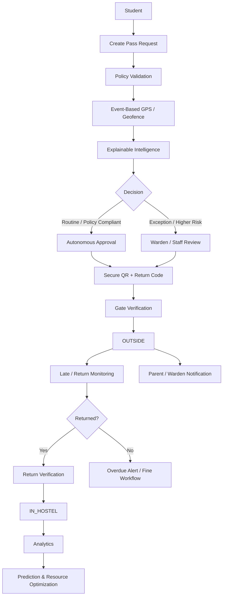

# 🛡️ NEXA-GUARD

<p align="center">
  
</p>

<h2 align="center">AI-Powered Smart Hostel Movement, Safety & Resource Intelligence Platform</h2>

<p align="center">
  <b>Smarter Movement. Safer Hostels.</b>
</p>

<p align="center">
  Built for <b>Smart India Hackathon (SIH) 2026</b> • <b>Team Alpha Gate</b>
</p>

<p align="center">
  
  
  
  
  
  
</p>

---

## 🚀 Project Overview

**NEXA-GUARD** is a **college-hostel-focused digital movement, safety and resource-intelligence platform** developed for **Smart India Hackathon 2026**.

It connects:

> **Student → Warden → Security Gate → Parent → Hostel Administration**

The platform transforms hostel movement from a basic register workflow into a **verified, policy-aware and intelligence-driven movement lifecycle**.

```text
MOVEMENT EVENT
      ↓
POLICY VALIDATION
      ↓
GPS / GEOFENCE VERIFICATION
      ↓
EXPLAINABLE INTELLIGENCE
      ↓
AUTOMATED APPROVAL / HUMAN ESCALATION
      ↓
SECURE QR + RETURN CODE
      ↓
SERVER-SIDE GATE VERIFICATION
      ↓
IN_HOSTEL ↔ OUTSIDE
      ↓
MONITORING + ALERTS
      ↓
ANOMALY / PREDICTION
      ↓
RESOURCE OPTIMIZATION
```

---

# 🏆 Smart India Hackathon 2026

NEXA-GUARD was developed for **SIH 2026** around the intelligent use of hostel movement data for:

- smart automation
- safety-oriented movement verification
- proactive monitoring
- operational analytics
- security resource planning
- institutional decision support

### SIH Alignment

```text
DATA COLLECTION
      ↓
POLICY VALIDATION
      ↓
EXPLAINABLE INTELLIGENCE
      ↓
AUTOMATION / HUMAN DECISION
      ↓
SECURE MOVEMENT
      ↓
ACTIONABLE INSIGHTS
      ↓
RESOURCE OPTIMIZATION
```

---

# 🎯 Problem

Traditional hostel movement workflows can be:

- paper-heavy
- slow at the gate
- difficult to monitor in real time
- dependent on manual follow-up for late returns
- vulnerable to invalid or expired movement credentials
- disconnected from parent communication
- unable to turn historical movement records into operational intelligence

NEXA-GUARD addresses these gaps through a single connected platform.

---

# 💡 From Paper Registers to Movement Intelligence

### Traditional

```text
Student
   ↓
Paper / Basic Form
   ↓
Warden
   ↓
Gate
```

### NEXA-GUARD

```text
Student
   ↓
Smart Pass Request
   ↓
Policy Engine
   ↓
Location Verification
   ↓
Explainable Intelligence
   ↓
Automatic Processing / Human Escalation
   ↓
Secure Digital Pass
   ↓
Gate Verification
   ↓
Live Movement State
   ↓
Alerts & Notifications
   ↓
Analytics & Anomaly Detection
   ↓
Prediction & Resource Optimization
```

---

# 🌟 Core Capabilities

## 🤖 1. Explainable Autonomous Approval

Routine, policy-compliant low-risk requests can follow the configured **autonomous approval path**.

The intelligence layer considers supported operational signals such as:

- request timing
- requested duration
- gate closing proximity
- geofence result
- recent movement frequency
- late-return history
- policy compliance
- relevant risk indicators

Exception and higher-risk cases can be escalated to authorized hostel staff for review.

> **Automation handles routine work; authorized staff retain control over exceptions and overrides.**

---

## 🎓 2. Academic-Hours Protection

Hostel administrators can configure restricted academic windows for casual movement.

Example:

```text
09:00 AM → 04:30 PM
```

The exact timings are **policy-configurable**, not a universal hard-coded rule.

Emergency movement can follow separate policy rules.

---

## 🚪 3. Gate Timing & Return Compliance

NEXA-GUARD evaluates return compliance using configured:

```text
Expected Return
      +
Gate Closing Deadline
      +
Grace Period
      ↓
Return Compliance Signal
```

Different hostels can configure their own operational timings and policies.

---

## 🏠 4. Flexible Multi-Day Home Pass

Students can request multi-day home passes according to institutional policy.

Exceptional or extended requests can be routed for additional verification such as guardian confirmation or staff review.

---

## 🍽️ 5. Mess & Dining Intelligence

Movement telemetry can support meal-demand estimation:

```text
Movement Data
      ↓
Expected Residents
      ↓
Meal Demand Estimation
      ↓
Preparation Planning
      ↓
Potential Waste Reduction
```

Breakfast, lunch and dinner estimates can be generated where sufficient operational and historical data exists.

---

## 🔐 6. Secure Gate Verification

The gate workflow validates:

- server-issued QR token
- secure return code
- pass validity
- expiry
- movement state
- prior-use state
- configured identity checks
- optional camera/biometric verification where enabled

The backend—not the browser—is the source of truth.

---

## 🏢 7. Configurable Hostel Infrastructure

Administrators can manage:

- Blocks
- Floors
- Rooms
- Bed capacities
- Gates
- Security Zones
- Policies
- Students
- Staff

The system is designed around configurable institutional structure rather than a fixed hostel layout.

---

## 📍 8. Event-Based Geofencing

NEXA-GUARD uses location as a **contextual verification signal**, not as continuous resident surveillance.

Typical events:

```text
PASS REQUEST
     ↓
LOCATION CHECK
     ↓
EXIT VERIFICATION
     ↓
RETURN VERIFICATION
```

The backend performs the authoritative geofence calculation.

> **Privacy principle:** verify the movement event that matters instead of continuously tracking hostel residents.

---

## 🧠 9. Behavioral Anomaly Detection

Supported anomaly patterns can include:

- unusually high movement frequency
- repeated late returns
- repeated failed gate verification
- location mismatch
- unusual movement timing
- repeated cancelled/expired passes
- policy deviations

The platform reports these as **movement anomalies / unusual activity**, not as unsupported criminal classifications.

---

## 📈 10. Predictive Movement Intelligence

Historical movement data can support:

- time-slot pattern analysis
- day-of-week patterns
- movement-demand estimation
- gate-load forecasting
- operational planning

Predictions are **estimates**, not guarantees.

---

# 🤖 NEXA AI — Role-Aware Institutional Assistant

NEXA AI is designed as a **context-aware assistant connected to authorized application data**, not as a generic FAQ chatbot.

### Architecture

```text
USER QUESTION
      ↓
AUTHENTICATION
      ↓
ROLE + PERMISSION CHECK
      ↓
INTENT DETECTION
      ↓
CONTROLLED DATA TOOL
      ↓
PARAMETERIZED QUERY
      ↓
LIVE POSTGRESQL DATA
      ↓
CONTEXT
      ↓
NEXA AI RESPONSE
```

### Example Questions

**Student**

> “Mera current pass status kya hai?”

**Warden**

> “Abhi kitne students hostel ke bahar hain?”

**Admin**

> “Aaj ka busiest gate kaunsa hai?”

**Parent**

> “Mera ward hostel mein hai?”

### AI Guardrails

NEXA AI cannot:

- access another student's private records
- bypass role permissions
- access another hostel's data
- execute arbitrary SQL
- directly modify database records
- perform sensitive actions without required authorization

### Safe Data Access Model

```text
User
 ↓
Intent
 ↓
Permission
 ↓
Approved Tool
 ↓
Parameterized Query
 ↓
PostgreSQL
 ↓
Structured Result
 ↓
AI Response
```

---

# 🧠 Intelligence Layer

```text
┌──────────────────────────────────────────────┐
│             NEXA-GUARD INTELLIGENCE          │
├──────────────────────────────────────────────┤
│ Explainable Risk Engine                      │
│ Behavioral Anomaly Detection                 │
│ Personal Movement Baseline                   │
│ Predictive Movement Intelligence             │
│ Gate / Security Resource Optimizer           │
│ Mess / Dining Demand Forecast                │
│ Operational Intelligence                     │
│ NEXA AI Assistant                            │
└──────────────────────────────────────────────┘
```

---

# 🔄 Complete Movement Lifecycle



---

# 🏗️ System Architecture

```text
┌──────────────────────────────────────────────────────────┐
│                     USER / PORTAL LAYER                   │
│                                                          │
│ Student │ Warden │ Guard │ Parent │ Hostel Admin        │
└──────────────────────────┬───────────────────────────────┘
                           │
                           ▼
┌──────────────────────────────────────────────────────────┐
│                  FRONTEND APPLICATION                     │
│                                                          │
│ HTML5 │ Tailwind CSS │ Vanilla JavaScript               │
│ Leaflet │ Chart.js │ Geolocation │ QR Scanner           │
└──────────────────────────┬───────────────────────────────┘
                           │ HTTPS / REST
                           ▼
┌──────────────────────────────────────────────────────────┐
│                  API / SECURITY LAYER                     │
│                                                          │
│ Node.js + Express.js                                     │
│ JWT │ RBAC │ Validation │ Rate Limiting                 │
│ Helmet │ CORS │ Tenant Isolation │ Audit Logs            │
└──────────────────────────┬───────────────────────────────┘
                           │
                           ▼
┌──────────────────────────────────────────────────────────┐
│           BUSINESS + INTELLIGENCE LAYER                  │
│                                                          │
│ Pass │ Policy │ Geofence │ Gate │ QR                    │
│ Risk │ Anomaly │ Baseline │ Prediction                  │
│ Optimizer │ Notifications │ NEXA AI                     │
└──────────────────────────┬───────────────────────────────┘
                           │
                           ▼
┌──────────────────────────────────────────────────────────┐
│                       DATA LAYER                          │
│                    PostgreSQL 16                          │
│                                                          │
│ Students │ Parents │ Passes │ Movements │ Gates         │
│ Policies │ Alerts │ AI Data │ Notifications │ Audit      │
└──────────────────────────────────────────────────────────┘
```

---

# 🛠️ Technology Stack

## Frontend

- **HTML5**
- **Tailwind CSS**
- **Vanilla JavaScript**
- **Leaflet.js**
- **Chart.js**
- **Browser Geolocation API**
- **QR scanning libraries**
- **HTML5 Canvas / WebRTC** for optional biometric verification

## Backend

- **Node.js 18+**
- **Express.js**
- RESTful API architecture
- Modular controllers, services and middleware

## Database

- **PostgreSQL 16**
- relational schema
- foreign keys
- constraints
- indexes
- transactional movement updates

## Security

- JWT authentication
- bcrypt password hashing
- Helmet
- CORS
- rate limiting
- RBAC
- hostel / tenant isolation
- parameterized SQL
- HMAC-SHA256 QR tokens
- audit logging

## Intelligence

- Explainable risk engine
- Behavioral anomaly detection
- Personal movement baseline
- Predictive movement intelligence
- Gate/security resource optimization
- Mess/dining demand forecasting
- Operational intelligence
- NEXA AI assistant

## Communication

- In-app notifications
- SMTP / Nodemailer transactional email

---

# 🔐 Security & Privacy

NEXA-GUARD follows a least-privilege and server-authoritative security model.

```text
User
 ↓
JWT Authentication
 ↓
Role Validation
 ↓
Hostel / Tenant Validation
 ↓
Permission Check
 ↓
Authorized Resource
 ↓
PostgreSQL
```

### Key controls

| Control | Purpose |
|---|---|
| JWT | Authenticated session identity |
| RBAC | Role-based authorization |
| Tenant Isolation | Prevent cross-hostel data access |
| bcrypt | Password hashing |
| Helmet | HTTP security headers |
| CORS | Controlled origins |
| Rate Limiting | Abuse / brute-force mitigation |
| Parameterized Queries | SQL injection protection |
| HMAC-SHA256 | QR token integrity |
| Audit Logs | Trace sensitive operations |
| Parent-Ward Link | Restrict parent access |

---

# 📱 Role-Based Portals

### 🎓 Student

Passes • Active QR • Return Code • Movement History • Alerts • NEXA AI

### 🧑‍🏫 Warden

Requests • Risk Signals • Exceptions • Overdue Monitoring • Anomalies

### 🛡️ Security Guard

QR Scan • Gate Verification • Exit • Return

### 👨‍👩‍👦 Parent

Linked Ward • Movement Status • Pass Status • Important Alerts

### 🏢 Hostel Admin

Hostel Setup • Students • Staff • Policies • Analytics • Resource Intelligence

---

# 🖥️ Working Prototype

> Add only **real screenshots from the current implementation**. Avoid using mock UI as proof of implementation.

### 🎓 Student Portal

<p align="center">
  
</p>

### 🧑‍🏫 Warden Portal

<p align="center">
  
</p>

### 🛡️ Security Guard Portal

<p align="center">
  
</p>

### 🏢 Admin Command Center

<p align="center">
  
</p>

### 👨‍👩‍👦 Parent Portal

<p align="center">
  
</p>

### ⚙️ Hostel Onboarding Wizard

<p align="center">
  
</p>

---

# 🔔 Notifications & Email

```text
SYSTEM EVENT
      ↓
NOTIFICATION SERVICE
      ↓
 ┌───────────────┐
 │               │
IN-APP          EMAIL
```

| Event | Recipient | Channel |
|---|---|---|
| Pass Request | Warden | In-app |
| Pass Approved | Student | In-app + Email |
| Pass Rejected | Student | In-app + Email |
| Gate Exit | Linked Parent | In-app |
| Gate Return | Linked Parent | In-app |
| Late Return | Warden + Parent | In-app + Email |
| Emergency | Warden + Parent | In-app + Email |
| Account Activation | User | Email |
| Password Reset | User | Email |
| Fine Issued | Student | In-app + Email |

Email is used selectively for high-value or important events rather than every routine movement event.

---

# 📊 Resource Optimization

```text
Gate Events
    ↓
Hourly Aggregation
    ↓
Peak Movement Detection
    ↓
Load Analysis
    ↓
Security / Gate Recommendation
```

Potential outputs:

- peak exit windows
- peak return windows
- gate bottlenecks
- uneven gate utilization
- suggested security coverage
- estimated dining demand

Recommendations support institutional decisions; they do not automatically replace them.

---

# 🚨 Alerts & Fine Management

Supported operational events include:

```text
LATE_RETURN
HIGH_RISK_REQUEST
INVALID_QR
REPEATED_FAILED_SCAN
LOCATION_MISMATCH
EXPIRED_PASS
UNAUTHORIZED_MOVEMENT
EMERGENCY
```

Late-return workflow:

```text
Expected Return
      ↓
Grace Period
      ↓
Overdue
      ↓
Alert
      ↓
Warden / Parent Notification
      ↓
Fine Workflow (where policy requires)
```

Fines are administrative records in the MVP and do not automatically charge real money.

---

# 🔌 API Highlights

```http
POST /api/auth/login

POST /api/passes/requests
GET  /api/passes/requests
POST /api/passes/requests/:id/approve
POST /api/passes/requests/:id/reject

POST /api/gate/scan
POST /api/gate/exit
POST /api/gate/entry

POST /api/ai/risk-score
POST /api/ai/assistant
GET  /api/ai/anomalies
GET  /api/ai/insights

GET  /api/notifications
GET  /api/analytics/overview
GET  /api/analytics/movements
```

See `docs/api.md` for the full API reference.

---

# ✅ Verification

### Latest Verified Build

- **31 PostgreSQL tables**
- **8 application interfaces**
- **44 automated tests passed**
- **0 failed**

Verified areas include:

- authentication
- RBAC
- parent privacy
- cross-hostel isolation
- pass creation
- policy validation
- QR security
- gate verification
- exit/return state transitions
- late-return monitoring
- anomaly detection
- notifications
- resource intelligence
- NEXA AI live-data authorization

> Keep these figures synchronized with the exact GitHub revision being published.

---

# 🎬 Recommended SIH Demo

```text
01  Student Login
02  Create Pass
03  Policy Validation
04  GPS / Geofence Verification
05  Intelligence / Risk Result
06  Automatic Approval or Staff Escalation
07  Secure QR Generation
08  Guard Verification
09  Student → OUTSIDE
10  Return Verification
11  Student → IN_HOSTEL
12  Parent / Warden Notification
13  Admin Analytics
14  NEXA AI Live-Data Query
15  Resource Recommendation
```

### Strong NEXA AI Demo Questions

> **Student:** “Mera current pass status kya hai?”

> **Warden:** “Abhi kitne students hostel ke bahar hain?”

> **Admin:** “Aaj ka busiest gate kaunsa hai?”

> **Parent:** “Mera ward hostel mein hai?”

---

# 📁 Repository Structure

```text
NEXA-GUARD/
│
├── backend/
│   ├── database/
│   │   ├── schema.sql
│   │   ├── migrate.js
│   │   └── seed.sql
│   │
│   ├── src/
│   │   ├── ai/
│   │   │   ├── riskEngine.js
│   │   │   ├── anomalyEngine.js
│   │   │   ├── baselineEngine.js
│   │   │   ├── predictionEngine.js
│   │   │   ├── resourceOptimizer.js
│   │   │   ├── insightEngine.js
│   │   │   └── assistantService.js
│   │   │
│   │   ├── controllers/
│   │   ├── middleware/
│   │   ├── routes/
│   │   ├── services/
│   │   ├── validators/
│   │   ├── utils/
│   │   └── config/
│   │
│   └── server.js
│
├── frontend/
│   ├── index.html
│   ├── login.html
│   ├── wizard.html
│   ├── admin.html
│   ├── warden.html
│   ├── guard.html
│   ├── student.html
│   └── parent.html
│
├── assets/
│   ├── logo.png
│   ├── student-portal.png
│   ├── warden-portal.png
│   ├── guard-portal.png
│   ├── admin-portal.png
│   ├── parent-portal.png
│   ├── onboarding-wizard.png
│   └── alpha-gate-team.png
│
├── docs/
│   ├── architecture.md
│   ├── api.md
│   ├── setup.md
│   └── FINAL-AUDIT.md
│
└── README.md
```

---

# ⚙️ Local Development

## Prerequisites

- Node.js 18+
- npm
- PostgreSQL 16 recommended
- Modern browser with Geolocation support

## 1. Clone

```bash
git clone <YOUR_GITHUB_REPOSITORY_URL>
cd NEXA-GUARD
```

## 2. Database

```sql
CREATE DATABASE nexaguard;
```

## 3. Environment

Create:

```text
backend/.env
```

Use `backend/.env.example` as the configuration template.

Never commit:

```text
.env
database passwords
JWT secrets
SMTP credentials
API keys
real personal credentials
```

## 4. Install Dependencies

```bash
cd backend
npm install
```

## 5. Initialize Database

Run the migration/schema workflow defined by the current repository revision.

Use only clearly identified synthetic/demo data for demonstration environments.

## 6. Start

```bash
node server.js
```

Open:

```text
http://localhost:5000
```

---

# 🛣️ Future Scope

- institution-trained ML prediction models
- richer forecasting
- Web Push notifications
- offline-capable secure gate synchronization
- native mobile applications
- deeper NEXA AI analytics
- policy/document retrieval
- large-scale multi-institution deployment
- privacy-preserving intelligence improvements

---

# 👥 Team Alpha Gate

## Built for Smart India Hackathon 2026

<p align="center">
  
</p>

| 👤 Member | 🎯 Role | 💡 Contribution |
|---|---|---|
| **Ajay Chauhan** | **Full Stack Developer** | System architecture, backend integration, core development & product direction |
| **Abhishek Dwivedi** | **API & Integration Developer** | REST API integration, frontend–backend connectivity & feature integration |
| **Piyush Kumar** | **Ideation & Solution Strategy** | Problem analysis, solution design, innovation & feature planning |
| **Anchal Dubey** | **UI/UX & Frontend Contributor** | Interface design, user experience & frontend enhancement |
| **Aman Kumar Pandey** | **Testing & Documentation** | Functional testing, validation, documentation & presentation support |
| **Rahul Chaudhary** | **Database & Data Management** | PostgreSQL database design, data handling & database integration |

> **One Team. One Vision. Smarter Movement. Safer Hostels.**

---

# 🔒 Public GitHub Security Checklist

Before publishing:

- [ ] `.env` is ignored
- [ ] No database passwords committed
- [ ] No JWT secrets committed
- [ ] No SMTP credentials committed
- [ ] No API keys committed
- [ ] No personal student credentials committed
- [ ] No private parent/guardian data committed
- [ ] Screenshots contain no sensitive credentials
- [ ] Team photo is approved for public use
- [ ] Team-member names are correct
- [ ] README matches the published code
- [ ] Test results match the published revision

---

# 📚 Documentation

```text
docs/
├── architecture.md
├── api.md
├── setup.md
└── FINAL-AUDIT.md
```

---

# 🌟 Why NEXA-GUARD?

```text
PAPER REGISTER
      ↓
RECORD

BASIC DIGITAL SYSTEM
      ↓
REQUEST + APPROVAL

NEXA-GUARD
      ↓
VERIFY
      ↓
VALIDATE
      ↓
INTELLIGENCE
      ↓
AUTOMATE / ESCALATE
      ↓
SECURE
      ↓
MONITOR
      ↓
DETECT
      ↓
PREDICT
      ↓
OPTIMIZE
```

> **NEXA-GUARD converts hostel movement from a record-keeping workflow into a verified, intelligence-driven operational system.**

---

## ❤️ Team Alpha Gate

**NEXA-GUARD**  
**Smart India Hackathon 2026**

> *Smarter Movement. Safer Hostels.*
