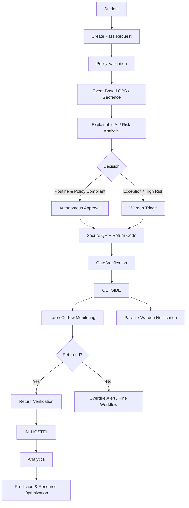
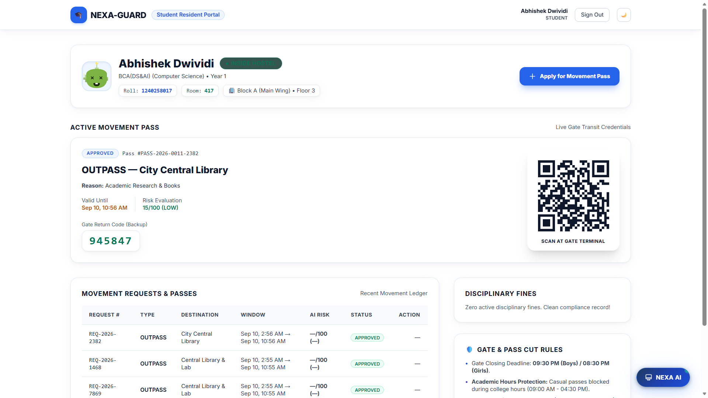
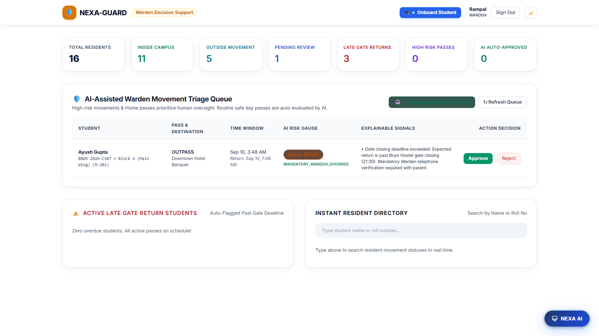
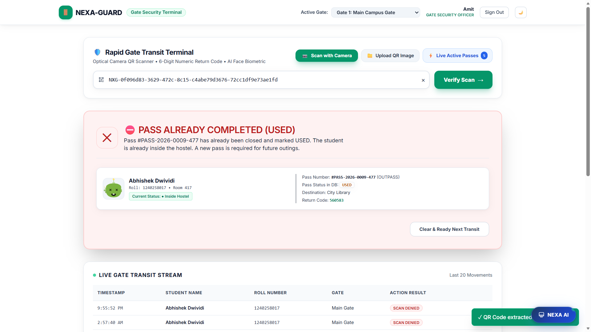
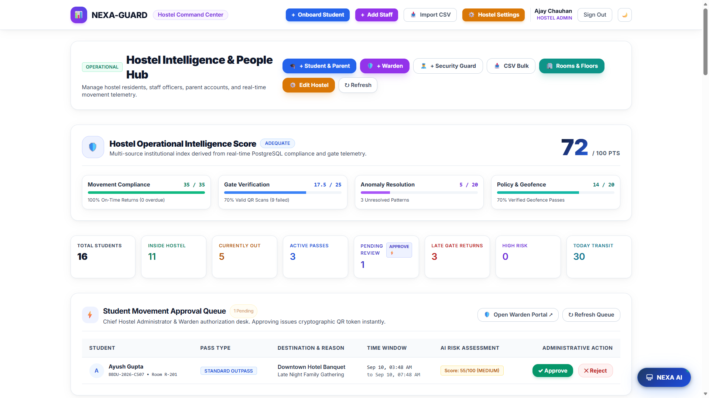
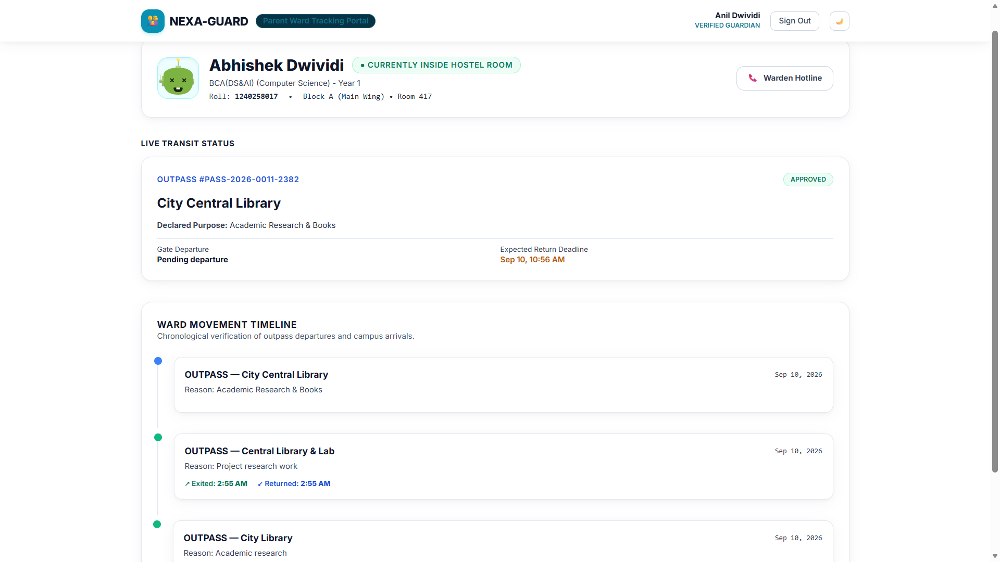
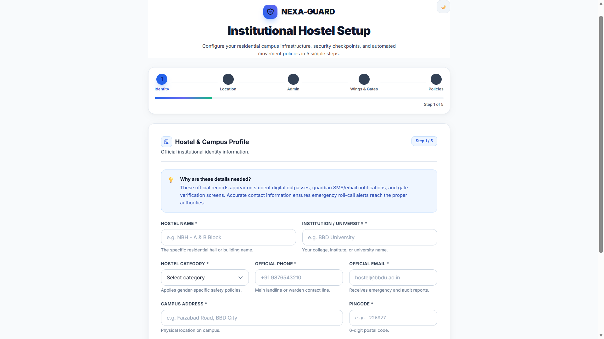
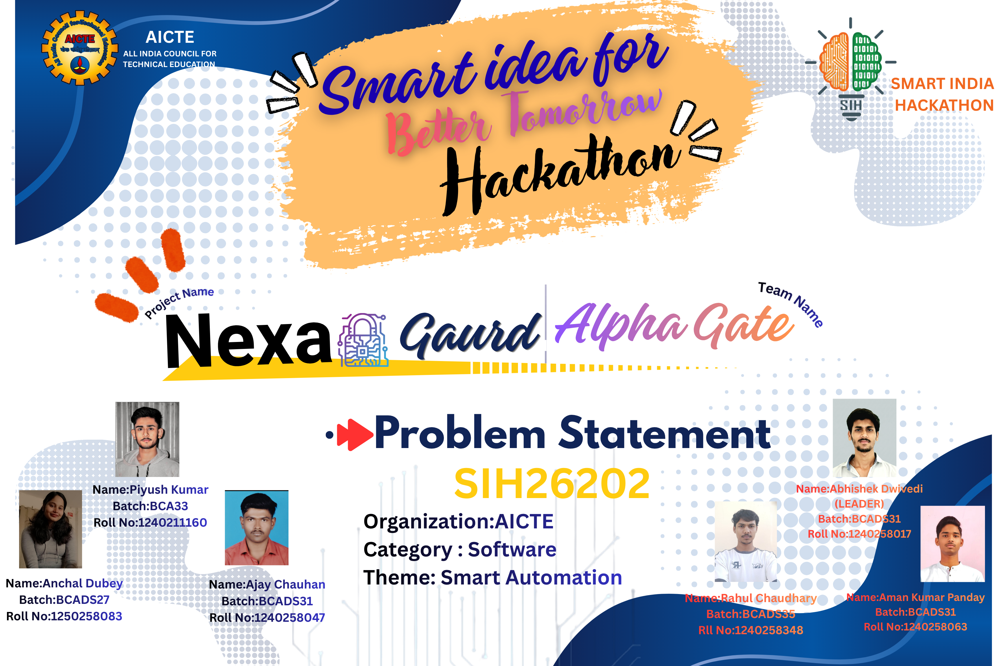

# 🛡️ NEXA-GUARD

<p align="center">
  
</p>

<h2 align="center">AI-Powered Smart Hostel Movement, Autonomous Approval & Safety Intelligence Platform</h2>

<p align="center">
  <b>Smarter Movement. Safer Hostels.</b>
</p>

<p align="center">
  Built for <b>Smart India Hackathon (SIH) 2026</b> • <b>Team Alpha Gate</b>
</p>

<p align="center">
  
  
  
  
  
  
</p>

---

## 🚀 Project Overview

**NEXA-GUARD** is a **college-hostel-focused digital movement, safety and resource-intelligence platform** developed for **Smart India Hackathon 2026**.

It connects:

> **Student → Warden → Security Gate → Parent → Hostel Administration**

The platform is designed to move hostel operations from a basic paper/register workflow to a **verified, automated and intelligence-driven movement lifecycle**.

```text
MOVEMENT EVENT
      ↓
POLICY VALIDATION
      ↓
GPS / GEOFENCE VERIFICATION
      ↓
EXPLAINABLE AI / RULE ENGINE
      ↓
AUTOMATED APPROVAL OR HUMAN ESCALATION
      ↓
SECURE QR + RETURN CODE
      ↓
SERVER-SIDE GATE VERIFICATION
      ↓
IN_HOSTEL ↔ OUTSIDE
      ↓
MONITORING + ALERTS
      ↓
ANOMALY / PREDICTION
      ↓
RESOURCE OPTIMIZATION
```

---

# 🏆 Smart India Hackathon 2026

NEXA-GUARD was built for **SIH 2026** around the intelligent use of hostel movement data for:

- safety-oriented movement verification
- smart automation
- proactive monitoring
- operational analytics
- security resource planning
- institutional decision support

### SIH Alignment

```text
DATA COLLECTION
        ↓
POLICY VALIDATION
        ↓
EXPLAINABLE INTELLIGENCE
        ↓
AUTOMATED / HUMAN DECISION
        ↓
SECURE MOVEMENT
        ↓
ACTIONABLE INSIGHTS
        ↓
RESOURCE OPTIMIZATION
```

---

# 🎯 Problem Statement

Traditional hostel movement management can be:

- paper-heavy
- slow at the gate
- difficult to monitor in real time
- vulnerable to invalid or outdated passes
- dependent on manual follow-up for late returns
- disconnected from parent communication
- unable to turn historical movement records into useful operational insights

NEXA-GUARD addresses these gaps through one connected platform.

---

# 💡 Core Innovation — From Paper Registers to Safety Intelligence

NEXA-GUARD is more than a digital outpass form.

### Traditional

```text
Student
   ↓
Paper / Basic Form
   ↓
Warden
   ↓
Gate
```

### NEXA-GUARD

```text
Student
   ↓
Smart Pass Request
   ↓
Policy Engine
   ↓
Location Verification
   ↓
AI / Intelligence
   ↓
Auto-Approve or Warden Escalation
   ↓
Secure Digital Pass
   ↓
Gate Verification
   ↓
Live Movement State
   ↓
Alerts
   ↓
Analytics
   ↓
Prediction
   ↓
Resource Optimization
```

---

# 🌟 Core Innovations

## 1. 🤖 Explainable AI Autonomous Approval Engine

Routine, policy-compliant requests can follow the configured **autonomous approval path**.

The engine evaluates supported signals such as:

- request timing
- requested duration
- gate closing proximity
- geofence result
- recent movement frequency
- late-return history
- policy compliance
- relevant risk indicators

High-risk or exception cases can be escalated to a **Warden Triage Queue**.

The system produces an explainable result rather than silently making an opaque decision.

---

## 2. 🎓 Academic-Hours Protection

Hostel policies can define restricted academic/lecture windows for casual movement.

Example policy configuration can restrict non-emergency movement during:

```text
09:00 AM → 04:30 PM
```

Emergency movement remains separately configurable.

**Important:** the timings are policy configuration, not hard-coded assumptions.

---

## 3. 🚪 Gate Closing & Return Deadline Intelligence

Hostels can configure gate timings and return deadlines according to their own institutional rules.

NEXA-GUARD evaluates:

```text
Pass Return Time
       +
Gate Closing Deadline
       +
Grace Period
       ↓
Return Compliance Signal
```

This allows different hostels to configure their own operational policies rather than depending on one fixed rule.

---

## 4. 🏠 Flexible Multi-Day Home Pass

Students can request multi-day home passes according to institutional policy.

The platform supports configurable duration and escalation rules instead of forcing a single arbitrary maximum.

Longer or exceptional requests can be routed for additional verification, such as guardian confirmation and warden review.

---

## 5. 🍽️ Mess & Food Operations Intelligence

Movement data can be used to estimate hostel meal demand.

```text
Student Movement
       ↓
Students Expected Inside
       ↓
Meal Demand Estimation
       ↓
Preparation Planning
       ↓
Potential Waste Reduction
```

The system can support breakfast, lunch and dinner demand estimation where sufficient historical/operational data exists.

> Estimates should always be treated as data-driven operational forecasts, not guaranteed savings.

---

## 6. 🔐 Secure Gate Return Verification

The gate terminal can combine multiple verification mechanisms supported by the implementation, including:

- server-side QR validation
- secure return code
- movement state validation
- configured identity checks
- optional camera/biometric verification where enabled

Biometric capability should be described as a **verification mechanism**, not as a guarantee of zero proxy movement.

---

## 7. 🏢 Manual Hostel Infrastructure Management

Hostel administrators can configure the physical hostel structure:

- Blocks
- Floors
- Rooms
- Bed capacities
- Gates
- Security Zones
- Policies

The model is designed so that the institutional structure is configurable rather than locked to a fixed hostel layout.

---

## 8. 📝 Professional Administrative Terminology

The interface uses operational language such as:

- **Gate Timings**
- **Gate Closing Deadline**
- **Late Gate Return**
- **Movement Status**
- **Policy Deviation**
- **Behavioral Anomaly**

This keeps the product suitable for institutional use.

---

## 9. 👨‍👩‍👦 Authentic Parent / Guardian Onboarding

Guardian information can be captured during student onboarding and linked through a dedicated parent–ward relationship.

Parents receive only authorized information for their linked student.

---

# 🤖 NEXA AI — Institutional Intelligence Assistant

NEXA AI is not intended to be a generic FAQ chatbot.

It follows a controlled application-data architecture:

```text
USER QUESTION
      ↓
AUTHENTICATION
      ↓
ROLE + PERMISSION CHECK
      ↓
INTENT DETECTION
      ↓
CONTROLLED DATA TOOL
      ↓
AUTHORIZED PARAMETERIZED QUERY
      ↓
LIVE POSTGRESQL DATA
      ↓
CONTEXT
      ↓
NEXA AI RESPONSE
```

### Example

**Student**

> “Mera current pass status kya hai?”

The system identifies the authenticated student and retrieves only that student's authorized pass data.

**Warden**

> “Abhi kitne students hostel ke bahar hain?”

The system uses a hostel-scoped data tool to retrieve the current movement state.

**Parent**

> “Mera ward hostel mein hai?”

The system uses the authenticated parent–ward relationship to return only the linked student's status.

### Security Principle

NEXA AI does **not** follow:

```text
User → LLM → Arbitrary SQL → Database
```

It follows:

```text
User
 ↓
Intent
 ↓
Permission
 ↓
Approved Tool
 ↓
Parameterized Query
 ↓
PostgreSQL
 ↓
Structured Result
 ↓
AI Response
```

---

# 🧠 Intelligence Modules

```text
┌───────────────────────────────────────────┐
│            NEXA-GUARD INTELLIGENCE        │
├───────────────────────────────────────────┤
│ Explainable Risk Engine                   │
│ Behavioral Anomaly Detection              │
│ Personal Movement Baseline                │
│ Predictive Movement Intelligence           │
│ Gate / Security Resource Optimizer        │
│ Mess / Dining Demand Forecast             │
│ Operational Intelligence                 │
│ NEXA AI Assistant                         │
└───────────────────────────────────────────┘
```

---

# 🔄 Complete Movement Lifecycle



---

# 🏗️ System Architecture

```text
┌──────────────────────────────────────────────────────────┐
│                     USER / PORTAL LAYER                   │
│                                                          │
│ Student │ Warden │ Guard │ Parent │ Hostel Admin        │
└──────────────────────────┬───────────────────────────────┘
                           │
                           ▼
┌──────────────────────────────────────────────────────────┐
│                  FRONTEND APPLICATION                     │
│                                                          │
│ HTML5 │ Tailwind CSS │ Vanilla JavaScript               │
│ Leaflet │ Chart.js │ Geolocation │ QR Scanner           │
└──────────────────────────┬───────────────────────────────┘
                           │ HTTPS
                           ▼
┌──────────────────────────────────────────────────────────┐
│                    API / SECURITY LAYER                   │
│                                                          │
│ Node.js + Express.js                                     │
│ JWT │ RBAC │ Validation │ Rate Limiting                 │
│ Helmet │ CORS │ Tenant Isolation │ Audit                │
└──────────────────────────┬───────────────────────────────┘
                           │
                           ▼
┌──────────────────────────────────────────────────────────┐
│              BUSINESS + INTELLIGENCE LAYER               │
│                                                          │
│ Pass │ Policy │ Geofence │ Gate │ QR                    │
│ Risk │ Anomaly │ Baseline │ Prediction                  │
│ Resource Optimizer │ Notifications │ NEXA AI            │
└──────────────────────────┬───────────────────────────────┘
                           │
                           ▼
┌──────────────────────────────────────────────────────────┐
│                      DATA LAYER                           │
│                    PostgreSQL 16                          │
│                                                          │
│ Students │ Parents │ Passes │ Movements │ Gates         │
│ Policies │ Alerts │ AI Data │ Notifications │ Audit      │
└──────────────────────────────────────────────────────────┘
```

---

# 🛠️ Technology Stack

## Frontend

- **HTML5**
- **Tailwind CSS**
- **Vanilla JavaScript**
- **Leaflet.js**
- **Chart.js**
- **Browser Geolocation API**
- **QR scanning libraries**
- **HTML5 Canvas / WebRTC** where biometric verification is enabled

## Backend

- **Node.js 18+**
- **Express.js**
- RESTful API architecture
- Modular controllers, services, middleware and AI modules

## Database

- **PostgreSQL 16**
- normalized relational schema
- foreign keys
- check constraints
- indexes
- transactional movement updates

## Security

- JWT authentication
- bcrypt password hashing
- Helmet
- CORS
- rate limiting
- RBAC
- hostel / tenant isolation
- parameterized SQL
- HMAC-SHA256 QR tokens
- audit logging
- secure activation tokens

## Intelligence

- Explainable risk engine
- Behavioral anomaly detection
- Personal movement baseline
- Predictive movement intelligence
- Gate/security resource optimization
- Mess/dining demand forecasting
- Operational intelligence
- NEXA AI assistant

## Communication

- In-app notifications
- SMTP / Nodemailer transactional email

---

# 🔐 Security Architecture

```text
User
 ↓
JWT Authentication
 ↓
Role Validation
 ↓
Hostel / Tenant Validation
 ↓
Permission Check
 ↓
Authorized Resource
 ↓
PostgreSQL
```

### Security controls

| Control | Purpose |
|---|---|
| JWT | Authenticated sessions |
| RBAC | Role-specific permissions |
| Tenant Isolation | Prevent cross-hostel access |
| bcrypt | Password protection |
| Helmet | HTTP security headers |
| CORS | Controlled origins |
| Rate Limiting | Abuse / brute-force mitigation |
| Parameterized Queries | SQL injection protection |
| HMAC-SHA256 | QR token integrity |
| Audit Logs | Sensitive-action traceability |
| Parent-Ward Link | Restricted guardian access |

---

# 📍 Privacy-First Location Verification

NEXA-GUARD uses location as **contextual verification**, not continuous surveillance.

Typical events:

```text
PASS REQUEST
     ↓
LOCATION CHECK
     ↓
EXIT VERIFICATION
     ↓
RETURN VERIFICATION
```

The backend performs the authoritative distance calculation.

> **Privacy principle:** verify the movement event that matters instead of continuously tracking hostel residents.

---

# 📱 Role-Based Portals

### 🎓 Student Portal

- Pass application
- Home pass
- Emergency exit
- Active digital QR
- Return code
- Movement history
- Notifications
- NEXA AI

### 🧑‍🏫 Warden Portal

- Approval / triage queue
- Risk & intelligence signals
- Exceptions
- Late-return monitoring
- Anomaly review
- Movement visibility

### 🛡️ Security Guard Portal

- QR scanning
- Server-side validation
- Exit authorization
- Return verification
- ALLOW / BLOCK / REVIEW result

### 👨‍👩‍👦 Parent Portal

- Linked ward only
- Movement status
- Pass status
- Return information
- Important alerts

### 🏢 Hostel Admin Command Center

- Hostel configuration
- Students / staff
- Rooms / blocks / gates
- Policies
- Movement analytics
- Anomaly radar
- Resource optimization
- Operational intelligence

The project documentation defines these role-specific portals and their workflows. fileciteturn17file4L371-L377

---

# 🖥️ Working Prototype

> Add only **real screenshots from the current NEXA-GUARD implementation**. Do not use fabricated UI as evidence.

### Student Portal

<p align="center">
  
</p>

### Warden Portal

<p align="center">
  
</p>

### Security Guard Portal

<p align="center">
  
</p>

### Admin Command Center

<p align="center">
  
</p>

### Parent Portal

<p align="center">
  
</p>

### Hostel Onboarding Wizard

<p align="center">
  
</p>

---

# 🔔 Notifications & Email

```text
SYSTEM EVENT
      ↓
Notification Service
     / \
    /   \
   ↓     ↓
IN-APP  EMAIL
```

### Example routing

| Event | Recipient | Channel |
|---|---|---|
| Pass Request | Warden | In-app |
| Pass Approved | Student | In-app + Email |
| Pass Rejected | Student | In-app + Email |
| Gate Exit | Linked Parent | In-app |
| Gate Return | Linked Parent | In-app |
| Late Return | Warden + Parent | In-app + Email |
| Emergency | Warden + Parent | In-app + Email |
| Account Activation | User | Email |
| Password Reset | User | Email |
| Fine Issued | Student | In-app + Email |

The project's verified notification/email design includes these event categories. fileciteturn17file13L1255-L1280

---

# 📊 Resource Optimization

NEXA-GUARD can convert movement telemetry into operational recommendations:

```text
Gate Events
    ↓
Hourly Aggregation
    ↓
Peak Movement Detection
    ↓
Load Analysis
    ↓
Guard / Gate Recommendation
```

Potential outputs:

- peak exit windows
- gate bottlenecks
- uneven utilization
- suggested security coverage
- estimated dining demand

These recommendations are intended to support institutional decisions rather than automatically replace them.

---

# 🚨 Alerts & Fine Management

Supported operational events can include:

```text
LATE_RETURN
HIGH_RISK_REQUEST
INVALID_QR
REPEATED_FAILED_SCAN
LOCATION_MISMATCH
EXPIRED_PASS
UNAUTHORIZED_MOVEMENT
EMERGENCY
```

Late-return processing can:

```text
Expected Return
      ↓
Grace Period
      ↓
Overdue
      ↓
Alert
      ↓
Warden / Parent Notification
      ↓
Fine Workflow where policy requires
```

The fine is an administrative record in the MVP; it does not automatically charge real money.

---

# 🧪 Verification

The latest project audit reports:

- **31 PostgreSQL tables**
- **8 verified frontend portals**
- **44 tests passed**
- **0 failed**
- **100% pass rate**

The verification includes authentication, RBAC, parent privacy, cross-hostel isolation, pass creation, QR verification, movement transitions, curfew monitoring, anomaly detection, resource insights, notifications and live-data NEXA AI access. fileciteturn17file2L209-L218 fileciteturn17file9L750-L797

> Keep these figures synchronized with the exact commit/release published on GitHub.

---

# 🎬 SIH Demonstration Flow

For a judge demonstration:

```text
01  Student Login
02  Create Pass
03  Policy Validation
04  GPS / Geofence Check
05  AI / Risk Result
06  Auto-Approval or Warden Escalation
07  Secure QR Generation
08  Guard Scans QR
09  Student → OUTSIDE
10  Return Verification
11  Student → IN_HOSTEL
12  Parent / Warden Notification
13  Admin Analytics
14  NEXA AI Live-Data Query
15  Resource Recommendation
```

### Suggested NEXA AI live questions

**Student**

> “Mera current pass status kya hai?”

**Warden**

> “Abhi kitne students hostel ke bahar hain?”

**Admin**

> “Aaj ka busiest gate kaunsa hai?”

**Parent**

> “Mera ward hostel mein hai?”

---

# 📁 Repository Structure

```text
NEXA-GUARD/
│
├── backend/
│   ├── database/
│   │   ├── schema.sql
│   │   ├── migrate.js
│   │   └── seed.sql
│   │
│   ├── src/
│   │   ├── ai/
│   │   │   ├── riskEngine.js
│   │   │   ├── anomalyEngine.js
│   │   │   ├── baselineEngine.js
│   │   │   ├── predictionEngine.js
│   │   │   ├── resourceOptimizer.js
│   │   │   ├── insightEngine.js
│   │   │   └── assistantService.js
│   │   │
│   │   ├── controllers/
│   │   ├── middleware/
│   │   ├── routes/
│   │   ├── services/
│   │   ├── validators/
│   │   ├── utils/
│   │   └── config/
│   │
│   └── server.js
│
├── frontend/
│   ├── index.html
│   ├── login.html
│   ├── wizard.html
│   ├── admin.html
│   ├── warden.html
│   ├── guard.html
│   ├── student.html
│   └── parent.html
│
├── screenshots/
│   ├── student-portal.png
│   ├── warden-portal.png
│   ├── guard-portal.png
│   ├── admin-portal.png
│   ├── parent-portal.png
│   └── onboarding-wizard.png
│
├── team/
│   └── alpha-gate-team.jpg
│
├── assets/
│   └── logo.png
│
└── README.md
```

The underlying project documentation describes this modular backend/frontend organization and the dedicated AI modules. fileciteturn17file12L1095-L1112

---

# ⚙️ Local Setup

## Prerequisites

- Node.js 18+
- npm
- PostgreSQL 16 recommended
- Modern browser with Geolocation support

## Clone

```bash
git clone <YOUR_GITHUB_REPOSITORY_URL>
cd NEXA-GUARD
```

## Database

```sql
CREATE DATABASE nexaguard;
```

## Environment

Create:

```text
backend/.env
```

Use `backend/.env.example` for configuration.

Example structure:

```env
PORT=5000
NODE_ENV=development

DB_HOST=localhost
DB_PORT=5432
DB_USER=postgres
DB_PASSWORD=YOUR_DATABASE_PASSWORD
DB_NAME=nexaguard

JWT_SECRET=YOUR_LONG_RANDOM_SECRET
JWT_EXPIRES_IN=7d

SMTP_HOST=YOUR_SMTP_HOST
SMTP_PORT=587
SMTP_USER=YOUR_SMTP_USER
SMTP_PASSWORD=YOUR_SMTP_PASSWORD
SMTP_FROM=YOUR_FROM_ADDRESS
```

## Install

```bash
cd backend
npm install
```

## Initialize

Run the database migration/schema process defined by the current repository revision.

For demonstration environments, use only clearly identified synthetic/demo data.

## Start

```bash
node server.js
```

Open:

```text
http://localhost:5000
```

---

# 🧭 Roadmap

Future enhancements may include:

- institution-trained ML prediction models
- richer forecasting
- Web Push notifications
- offline-capable secure gate synchronization
- native mobile applications
- deeper NEXA AI analytics
- policy/document retrieval
- large-scale multi-institution deployment
- privacy-preserving intelligence improvements

---

# 👨‍💻 Team Alpha Gate

## Built for Smart India Hackathon 2026

<p align="center">
  
</p>

### Team Members

| Member | Role | Contribution |
|---|---|---|
| **Ajay Chauhan** | Team Lead / Full Stack | Architecture, integration, backend & product direction |
| **[Member 2 Name]** | [Role] | [Contribution] |
| **[Member 3 Name]** | [Role] | [Contribution] |
| **[Member 4 Name]** | [Role] | [Contribution] |
| **[Member 5 Name]** | [Role] | [Contribution] |
| **[Member 6 Name]** | [Role] | [Contribution] |

> **Team note:** The project materials available to me verify **Ajay Chauhan** as a team member, but they do not contain the remaining Alpha Gate member names. I have intentionally left those fields as placeholders instead of inventing names. Replace them with the exact names from your SIH 2026 team registration before publishing.

---

# 🔒 Public GitHub Security Checklist

Before making this repository public:

- [ ] `.env` is ignored
- [ ] No database passwords committed
- [ ] No JWT secrets committed
- [ ] No SMTP credentials committed
- [ ] No API keys committed
- [ ] No personal student credentials committed
- [ ] No private parent/guardian data committed
- [ ] Screenshots contain no sensitive credentials
- [ ] Team photo is approved for public use
- [ ] Team-member names are correct
- [ ] README matches the published code
- [ ] Test results match the published revision

---

# 📚 Documentation

Recommended supporting documentation:

```text
docs/
├── architecture.md
├── api.md
├── setup.md
└── FINAL-AUDIT.md
```

The project already maintains architecture, API, setup and audit documentation for the implementation. fileciteturn18file17L480-L487

---

# 🌟 Why NEXA-GUARD?

```text
PAPER REGISTER
      ↓
RECORD

BASIC DIGITAL SYSTEM
      ↓
REQUEST + APPROVAL

NEXA-GUARD
      ↓
VERIFY
      ↓
VALIDATE
      ↓
INTELLIGENCE
      ↓
AUTOMATE / ESCALATE
      ↓
SECURE
      ↓
MONITOR
      ↓
DETECT
      ↓
PREDICT
      ↓
OPTIMIZE
```

> **NEXA-GUARD converts hostel movement from a record-keeping workflow into a verified and intelligence-driven operational system.**

---

## ❤️ Team Alpha Gate

**NEXA-GUARD 2.0**  
**Smart India Hackathon 2026**

> *Smarter Movement. Safer Hostels.*
